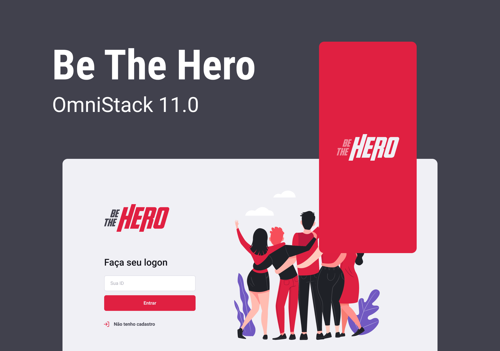

 
<h1 align="center">
    
</h1>

Projeto resultado da <a href="https://github.com/Rocketseat/semana-omnistack-11">Semana OmniStack 11</a> da <a href="https://rocketseat.com.br/">Rocketseat</a>. Uma aplicação para ajudar as ongs na arrecadação de fundos.

  <a href="https://www.youtube.com/watch?v=KKmXsj1vxeE">
  
  Veja esse video demonstração!
  </a>

 
<h2>👨‍💻 Tecnologias Utilizadas</h2>
<ul>
<li>BackEnd</li>
<ul align="justify">
<li><b>NodeJS:</b> É uma plataforma que permite utilizar o JavaScript para criar aplicações do lado do servidor (server-side).</li>
<li><b>Express:</b> É um framework para Node.js que permite a criação de aplicações web.</li>
<li><b>Knex:</b> É um query builder para Node.js que permite a criação de SQL queries utilizando JavaScript.</li>
<li><b>PostgreSQL:</b> É um sistema gerenciador de banco de dados objeto relacional.</li>
<li><b>Jest:</b> É um framework de teste em JavaScript.</li>
<li><b>Celebrate:</b> É um middleware para validação de dados.</li>
</ul>
<li>FrontEnd</li>
<ul align="justify">
<li><b>ReactJS:</b> É uma biblioteca JavaScript de código aberto com foco em criar interfaces de usuário em páginas web.</li>
<li><b>Axios:</b> É um cliente HTTP baseado em Promises para fazer requisições.</li>
<li><b>React Router DOM:</b> É uma biblioteca de roteamento.</li>
</ul>
<li>Mobile</li>
<ul align="justify">
<li><b>React Native:</b> É uma biblioteca JavaScript de código aberto com foco em criar interfaces de usuário em páginas web.</li>
<li><b>Expo:</b> É uma ferramenta utilizada no desenvolvimento mobile com React Native que permite o fácil acesso às API's nativas do dispositivo sem precisar instalar qualquer dependência ou alterar código nativo.</li>
<li>Expo Mail Composer: É uma ferramenta que permite o envio de e-mails.</li>
<li><b>Axios:</b> É um cliente HTTP baseado em Promises para fazer requisições.</li>
<li><b>React Navigation:</b> É uma biblioteca de roteamento.</li>
</ul>
</ul>
 

<h2>📁 Estrutura de Pastas</h2>

<h3>🤖 Pasta BackEnd</h3>

Nessa pasta contem todo o código do servidor, que é reponsavel por fornecer ao front-end web e mobile os dados das ongs cadastradas e dos casos cadastrados por cada ong.

<h4> Acesso a API</h4>

A API está hospedada no Heroku e pode ser acessada através do link: <a href="https://google.gui.dev.br:3102">https://google.gui.dev.br:3102</a>. E o download de sua especificação usando o Insominia estão disponíveis no arquivo <a href="insomnia.json">insomnia.json</a> neste repositório.

<h4> Intalação</h4>

Você pode realizar a instação de duas maneiras:

<h5>1. Via Docker:</h5>

Execute o comando que está dentro do arquivo de shell script <code>run_compose.sh</code> na pasta <code>backend</code>.
 
Apos a execução desse comando o servidor estarar rodando na porta <code>3002</code>.

<h5>2. Via NPM:</h5>

Execute o comando <code>npm install</code> na pasta <code>backend</code> para instalar todas as dependências.
 
Configure um arquivo <code>.env</code> na pasta <code>backend</code> com as variáveis de ambiente de acordo com o arquivo <code>.env.example</code>.
 
Por fim execute o comando <code>npm start</code> para iniciar o servidor.
 
Apos a execução desse comando o servidor estarar rodando na porta <code>3000</code>.

<h3>🖥 Pasta FrontEnd</h3>

Nessa pasta contem todo o código do front-end web, que é reponsavel por fornecer a interface para o cadastro de ongs e casos.

<h4> Acesso a Aplicação</h4>

A aplicação está hospedada na Vercel e pode ser acessada através do link: <a href="https://be-the-hero.gui.dev.br">https://be-the-hero.gui.dev.br</a>.

<h4> Intalação</h4>

Execute o comando <code>npm install</code> na pasta <code>frontend</code> para instalar todas as dependências.
 
Apos a instalação das dependências execute o comando <code>npm start</code> para iniciar o servidor.
 
Apos a execução desse comando o servidor estarar rodando na porta <code>3000</code>.

<h3>📱 Pasta Mobile</h3>

Nessa pasta contem todo o código do front-end mobile, que é reponsavel por fornecer a interface para o cadastro de ongs e casos.

<h4> Acesso a Aplicação</h4>

Por questões técnicas, o download da aplicação está disponível somente para android e fora da Google Play Store. Lembre-se de habilitar a instalação de aplicativos de fontes desconhecidas.Use o <a href="https://github.com/gsbenevides2/bethehero/releases/tag/1.0.0"> link</a> para fazer download do APK.

<h4> Intalação</h4>

Execute o comando <code>npm install</code> na pasta <code>mobile</code> para instalar todas as dependências.
 
Apos a instalação das dependências execute o comando <code>npm start</code> para iniciar o metro bundler.
 
Baixe o aplicativo do Expo na Play Store ou App Store.
 
Abra o aplicativo do Expo e escaneie o QR Code gerado pelo metro bundler.
 
Aguarde o carregamento do aplicativo.

<h2>🫶 Agradecimentos</h2>
<ul align="justify">
<li>Agradeço a <a href="https://rocketseat.com.br/">Rocketseat</a> por proporcionar essa espetacular experiência.</li>
<li>Agradeço especialmente seu CTO <a href="https://github.com/diego3g">Diego Fernandes</a> por proporcionar essa espetacular experiência. E também a todos que trabalham nessa empresa incrível e estiveram presentes no suporte do Discord durante a semana.</li>
<li>Agradeço ao <a href="https://github.com/filipedeschamps">Filipe Deschamps</a> por sempre estar apoiando a comunidade de desenvolvimento.</li>
</ul>

<h2>🔗 Links</h2>
<ul>
<li><a href="https://www.figma.com/file/v59Qo5a9CbbY4HaD79Estk/Be-The-Hero?type=design&node-id=4151-99&mode=design&t=4ueAXDVTeK2jLxpZ-0">Prototipagem do Projeto no Figma</a></li>
</ul>

<h2>📃 Licença</h2>

Este projeto está sobre a licença MIT. Veja ela em: <a href="LICENSE">LICENSE</a>.

Feito com ❤️ por <a href="https://gui.dev.br">gsbenevides2</a>

